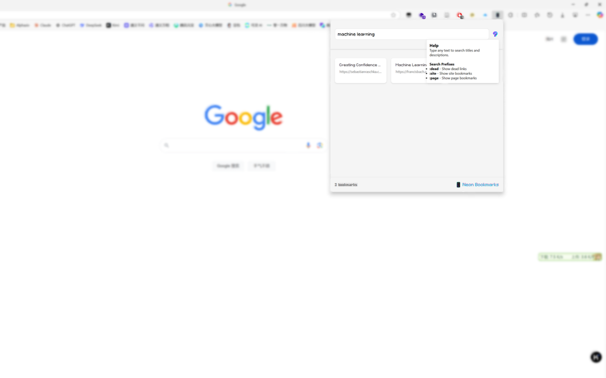

# Neon Bookmarks 🌟

  
  
  A sleek browser extension for managing your bookmarks with a neon aesthetic

## Features

- 🎯 Quick bookmark search functionality
- 🎨 Stunning neon-themed interface
- ⚡ Fast and responsive design
- 🗑️ Easy bookmark deletion
- 📱 Modern and clean UI

## Development

The extension is built using vanilla JavaScript, CSS, and HTML, making it lightweight and easy to maintain.

1. Download the extension files
2. Open your browser's extension page
3. Enable developer mode
4. Click "Load unpacked extension"
5. Select the `neon_bookmarks` directory

## License

This project is fully copyrighted by [NKYX](https://github.com/NKYX)